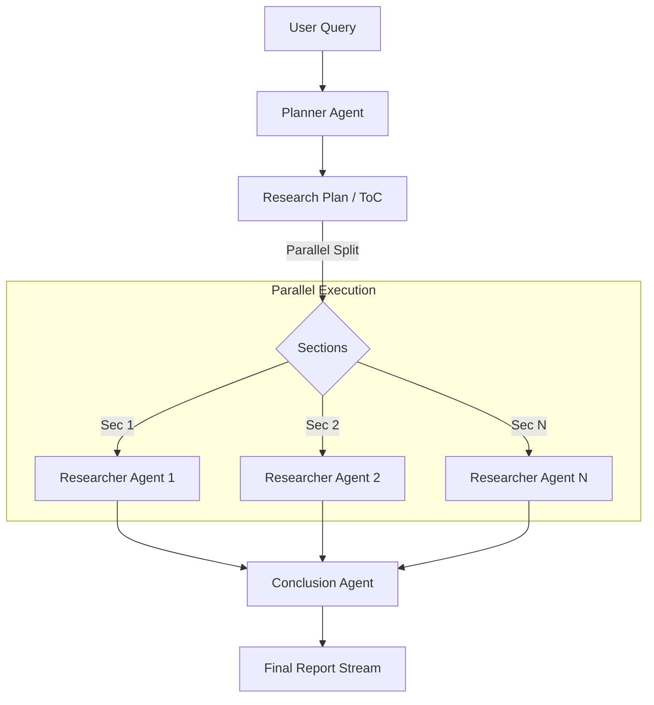

# Prism AI (Open Source Deep Research)

**An open-source AI research agent that thinks like a human analyst.**

[](https://opensource.org/licenses/MIT)


> **Alternative to:** Perplexity Pro, OpenAI Deep Research.

---

## 🚀 Why Prism AI?

LLMs are great at summaries but bad at **deep research**. They hallucinate, miss key details, and struggle with long-context tasks.

**Prism AI solves this by orchestrating a team of autonomous agents.** Instead of a single inference pass, it uses a **Plan-and-Execute** architecture to:
1.  **Plan**: Break down a complex query into a structured Table of Contents.
2.  **Research**: Spawn multiple "Researcher Agents" to search, crawl, and read the web in parallel.
3.  **Synthesize**: Aggregate findings into a cohesive, cited report.
4.  **Visualize**: Generate custom charts and diagrams to explain complex data.

## 🎥 Demo

[](https://res.cloudinary.com/chopwell/video/upload/v1767778690/prism_ai_1_2_ukywot.mp4)

---

## ✨ Key Features

*   **🧠 Plan-and-Execute Pattern**: Uses a `PlanningAgent` to generate a research roadmap before executing.
*   **⚡ Parallel Execution**: Utilizes Python `asyncio` to run 5+ research agents simultaneously, reducing latency by 80%.
*   **🔄 LangGraph State Machine**: Agents aren't just chains; they are state machines that can self-correct, loop back, and retry searches if information is missing.
*   **📊 Dynamic Visualization**: The agent can decide to generate custom React components (charts, diagrams) to better explain its findings.
*   **🔍 Transparent Sources**: Every claim is cited with a direct link to the source.

---

## 🏗️ Architecture

Prism AI is built on a microservices architecture designed for scalability.



*   **Core**: Python, LangGraph, LangChain.
*   **API**: Node.js, Express.
*   **Frontend**: Next.js, React, Tailwind.
*   **Real-time**: Go WebSocket Server, Redis.

---

## ⚡ Quick Start

Get up and running in minutes using Docker.

### Prerequisites
*   Docker & Docker Compose
*   OpenAI API Key
*   Serper API Key (for Google Search)

### Installation

1.  **Clone the repository**
    ```bash
    git clone https://github.com/precious112/prism-ai-deep-research.git
    cd prism-ai-deep-research
    ```

2.  **Set up environment variables**
    ```bash
    cp .env.example .env
    # Edit .env with your API keys
    ```

3.  **Run with Docker**
    ```bash
    docker-compose up --build
    ```

Visit `http://localhost:3000` to start researching.

---

## 📚 Documentation

For detailed guides on development, deployment, and architecture, visit the [docs](./docs) directory.

*   [**Installation Guide**](./docs/01-getting-started/02-installation.md) - Full setup instructions.
*   [**Architecture Deep Dive**](./docs/02-architecture/01-overview.md) - How the agents work internally.
*   [**Development Workflow**](./docs/03-guides/01-development-workflow.md) - How to contribute.

---

## 🤝 Contributing

We welcome contributions! Please see our [Development Workflow](./docs/03-guides/01-development-workflow.md) to get started.

## 📄 License

Distributed under the MIT License. See `LICENSE` for more information.
