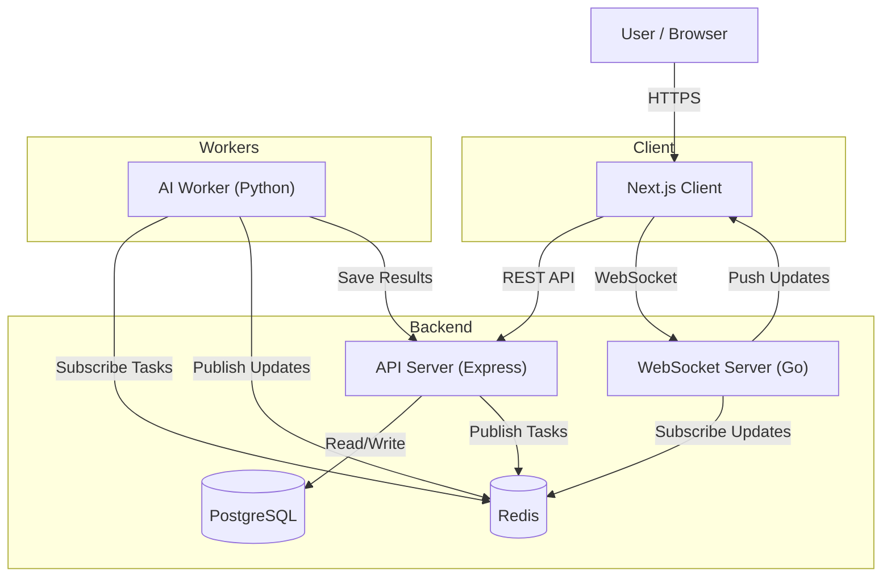

# Prism AI - Architecture Overview

## 1. Project Overview

Prism AI is an open-source AI research agent designed to be an alternative to services like Perplexity AI's research feature. It is composed of a web-based client, a backend API, a real-time communication server, and a set of Python-based AI workers. The entire project is housed in a monorepo to facilitate open-source collaboration.

The primary goals of this project are to showcase senior-level software engineering skills in TypeScript, Python, and Go, and to create a high-quality, "world-class" open-source application.

## 2. High-Level Architecture

Prism AI is built on a microservices-oriented architecture. This design promotes scalability, resilience, and a clear separation of concerns, allowing each component to be developed, deployed, and scaled independently.

The core of the architecture is a set of decoupled services that communicate asynchronously via a message broker.

## 3. Component Breakdown

The project is divided into four main services:

*   **`client/` (Next.js)**: The user-facing application built with Next.js and TypeScript. It handles all user interactions, sends requests to the API backend, and receives real-time updates from the WebSocket server.

*   **`api/` (Express.js)**: The central API for the application, built with Express.js and TypeScript. Its responsibilities include:
    *   Handling user authentication and authorization (in "online" mode).
    *   Providing a REST API for the client.
    *   Receiving research requests and dispatching them as tasks to the message broker.
    *   Persisting results to a PostgreSQL database using Prisma as the ORM.

*   **`core/` (Python AI Workers)**: A set of Python-based workers responsible for the core AI and research functionality. These workers:
    *   Listen for tasks on the message broker.
    *   Execute complex, long-running research tasks.
    *   Publish progress updates and final results back to the message broker.
    *   Uses LangGraph to manage state and complex agent workflows.

*   **`websocket/` (Go)**: A high-performance WebSocket server written in Go. Its sole purpose is to provide a real-time communication channel between the backend and the client. It listens for progress updates from the AI workers via the message broker and pushes them to the connected clients.

## 4. Technology Stack

*   **Frontend**: Next.js 14 (App Router), React, TypeScript, Tailwind CSS, Shadcn UI
*   **API Backend**: Express.js, TypeScript, Node.js
*   **AI Workers**: Python 3.11+, LangChain, LangGraph
*   **WebSocket Server**: Go, Gorilla WebSocket
*   **Database**: PostgreSQL
*   **ORM**: Prisma
*   **Message Broker**: Redis
*   **Containerization**: Docker

## 5. Local/Offline Mode

To facilitate ease of development and contribution, the project supports a local "offline" mode, managed via Docker Compose. This is controlled by an `OFFLINE_MODE` environment variable.

*   **`OFFLINE_MODE=false`**: The configuration for the live, deployed version. It includes features like user authentication via email/password or OAuth.
*   **`OFFLINE_MODE=true`**: The configuration for local development. In this mode, authentication is disabled or simplified, allowing developers to work on features without needing complex auth setup.

This approach significantly lowers the barrier to entry for new developers and allows for easy testing and development.
