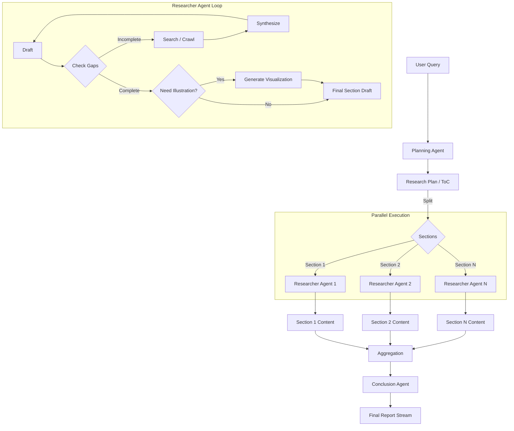

# AI Workers Architecture

The AI Worker service (`core/`) is the intelligence engine of Prism AI. It is a standalone Python application designed to execute complex, multi-step research tasks asynchronously.

## 1. Overview

The worker operates on a **"Plan-and-Execute"** architecture. It breaks down a user query into manageable sections, researches them in parallel using **LangGraph** agents, and streams a synthesized final report back to the client.

### Key Technologies
*   **Runtime**: Python 3.11+
*   **Orchestration**: Custom AsyncIO Event Loop + Redis
*   **Agent Framework**: LangChain & LangGraph
*   **Search Tools**: Google Serper (Search), Custom Crawler (Direct URL)
*   **Visualizations**: Custom Illustration Tool (D3, P5, Mermaid)

## 2. The Agent Workflow



### A. Planning Agent
*   **Role**: Architect.
*   **Input**: User Query.
*   **Logic**: Uses an LLM to generate a structured **Table of Contents (ToC)**.
*   **Output**: A list of sections to research.

### B. Researcher Agent (LangGraph)
*   **Role**: Specialist.
*   **Execution**: One instance is spawned *per section* of the ToC (Parallel Execution).
*   **Logic**: Implemented as a State Graph.
    1.  **Check Gaps**: Analyzes the current draft. Decides if more info is needed.
    2.  **Tool Selection**: Chooses between **Search** (broad queries) or **Crawl** (deep dive into specific URLs).
    3.  **Synthesize**: Updates the section draft with new findings.
    4.  **Illustrate**: Once the text is complete, decides if a visualization (chart/diagram) would help explain the concept.
*   **Output**: A comprehensive draft for that specific section, including source citations and optional visualization code.

### C. Conclusion Agent
*   **Role**: Editor & Publisher.
*   **Logic**:
    *   **Context-Aware Refinement**: Iterates through the completed drafts.
    *   **Deduplication**: Feeds the accumulated report context back into the LLM to ensure the next section flows naturally.
    *   **Streaming**: Yields the refined content token-by-token.

## 3. Illustration Tool

The **Illustration Tool** allows the agents to generate custom, code-based visualizations when text isn't enough.

*   **Capabilities**:
    *   **Mermaid**: for diagrams (flowcharts, sequence, class diagrams).
    *   **D3.js**: for data-driven charts.
    *   **P5.js**: for conceptual animations and simulations.
    *   **Three.js**: for 3D concepts.
    *   **HTML/CSS**: for simple layouts.
*   **Process**:
    1.  Agent decides a visualization is needed.
    2.  Tool selects the best library (e.g., "Use Mermaid for this system architecture").
    3.  LLM generates the code (HTML/JS).
    4.  Tool verifies the code (syntax check, completeness) before returning it.

## 4. Communication Protocol

The Worker communicates with the rest of the system via **Redis**.

### Input: `research_tasks`
The API publishes tasks to this Redis list.
```json
{
  "requestId": "uuid",
  "userId": "uuid",
  "chatId": "uuid",
  "query": "Research Quantum Physics",
  "config": { "model": "gpt-4-turbo", "provider": "openai" }
}
```

### Output: `updates`
The Worker publishes real-time events to this Redis channel.

#### Event Types
*   **`plan_created`**: The ToC is ready.
*   **`research_started`**: A researcher has started working on a section.
*   **`tool_start`**: An agent is using Google Search, Crawling, or Illustrating.
*   **`source_found`**: A relevant source or visualization was created.
*   **`report_chunk`**: A piece of the final report (Streamed).
*   **`completed`**: The process is finished.

## 5. Development

The worker source code is located in `core/`.
To run locally:
```bash
cd core
uv run src/worker.py
```
